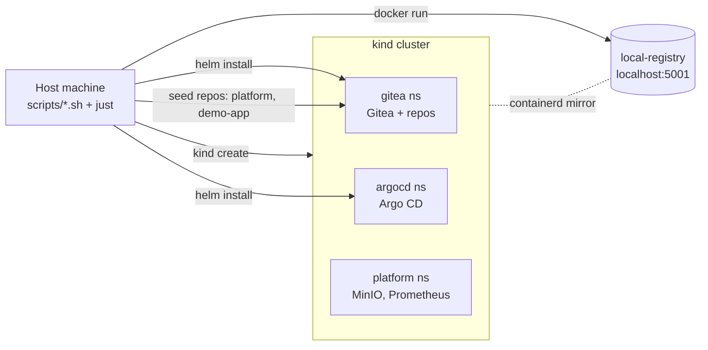
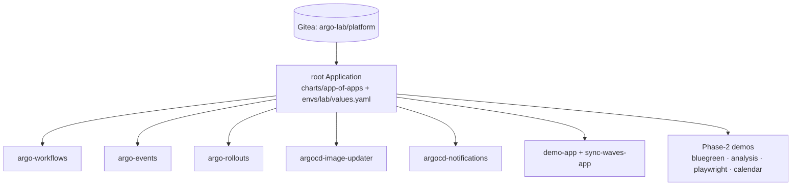
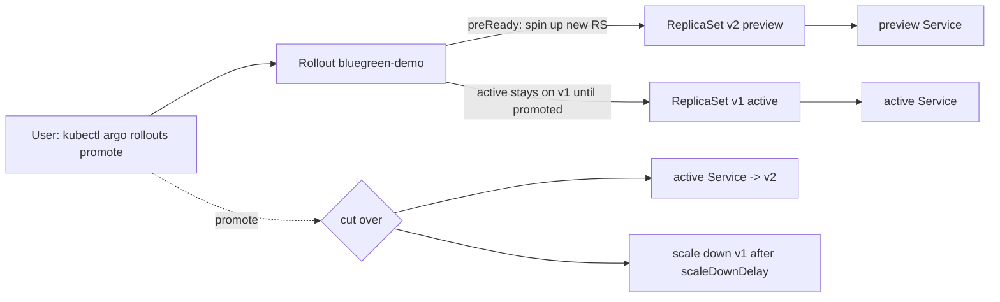
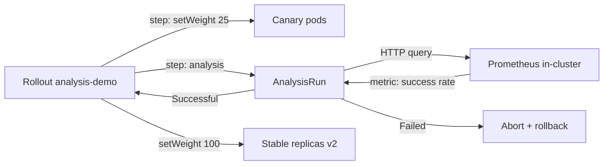
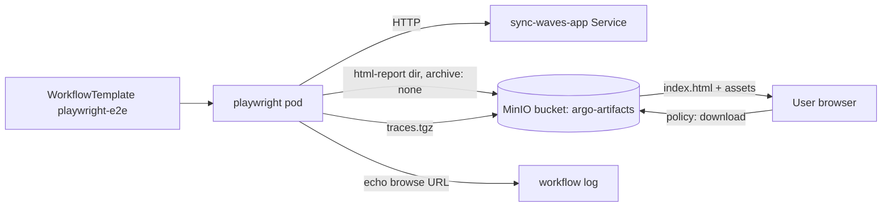
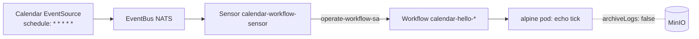

# Kind Argo Lab

Self-contained local platform lab for Argo CD, Argo Workflows, Argo Events, Argo Rollouts, Argo Notifications, and Argo CD Image Updater.

This project bootstraps a kind cluster, deploys local Gitea and a local Docker registry, seeds GitOps repos, and hands control to Argo CD through an app-of-apps root. The test flow validates the full event-driven loop from Git push to rollout promotion path.

## What It Builds

- kind cluster (`argo-lab`) with local registry wiring
- Local Gitea org/repos for platform and demo app
- Argo CD root app rendering child applications from `charts/app-of-apps` (Helm) with env overrides in `envs/lab/values.yaml`
- Helm wrapper charts for Argo components and demo app
- Event pipeline: Gitea webhook -> Argo Events -> Workflow trigger
- Image update loop: registry tag -> Image Updater git write-back -> Argo CD sync
- Canary delivery via Argo Rollouts

## Lab Architecture

Three views of the same lab — bootstrap, GitOps fan-out, and the event-driven image-update loop.

### 1. Bootstrap topology

What `just up` brings online and how the host talks to the cluster.

### 2. GitOps fan-out (app-of-apps)

Argo CD reads one root app and creates everything else.

### 3. Event-driven image update loop

The headline end-to-end flow exercised by `tests/test-e2e-chain.sh`.

```mermaid
flowchart LR
  DEV[git push to demo-app repo] --> WH[Gitea webhook]
  WH --> ES[EventSource /gitea]
  ES --> BUS[EventBus NATS]
  BUS --> SEN[Sensor]
  SEN --> WFT[WorkflowTemplate<br/>image-build-stub]
  WFT -->|push tag| REG[(local-registry)]
  REG --> IU[Image Updater]
  IU -->|git write-back| GITEA[(Gitea: demo-app)]
  GITEA --> ARGO[Argo CD sync]
  ARGO --> RO[Rollout canary<br/>20% -> promote -> 100%]
  RO --> NOTIF[Notifications -> log sink]
```

## Commands (Just)

- `just up` bootstraps the full lab
- `just status` prints cluster/application status
- `just test` runs `scripts/e2e-test.sh`
- `just down` tears down cluster and registry
- `just reset` does down then up

## Demo Workflows

Each demo lives in its own chart under [charts/](charts) and ships with a matching test under [tests/](tests).

### Blue/Green rollout — manual promotion

[charts/rollout-bluegreen-demo](charts/rollout-bluegreen-demo) · [tests/test-rollout-bluegreen.sh](tests/test-rollout-bluegreen.sh)

### Canary with Prometheus AnalysisTemplate

[charts/rollout-analysis-demo](charts/rollout-analysis-demo) · [tests/test-rollout-analysis.sh](tests/test-rollout-analysis.sh)

### Playwright e2e with browseable MinIO artifacts

[charts/playwright-e2e-demo](charts/playwright-e2e-demo) · [tests/test-playwright-e2e.sh](tests/test-playwright-e2e.sh)

### Calendar EventSource → Workflow

[charts/calendar-event-demo](charts/calendar-event-demo) · [tests/test-calendar-event.sh](tests/test-calendar-event.sh)

> Note: the cluster-default `archiveLogs` is set to `false` in [charts/argo-workflows/templates/artifact-repository.yaml](charts/argo-workflows/templates/artifact-repository.yaml) so high-frequency demos don't fill the bucket. Workflows that need artifacts declare them explicitly via `outputs.artifacts` (see Playwright above).

