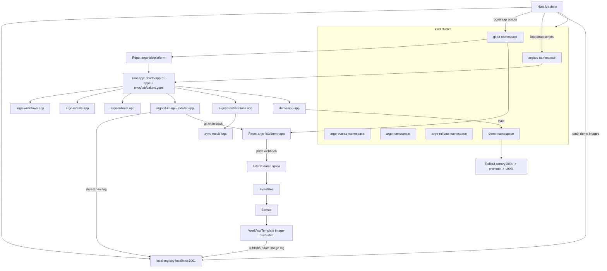

# Kind Argo Lab

Self-contained local platform lab for Argo CD, Argo Workflows, Argo Events, Argo Rollouts, Argo Notifications, and Argo CD Image Updater.

This project bootstraps a kind cluster, deploys local Gitea and a local Docker registry, seeds GitOps repos, and hands control to Argo CD through an app-of-apps root. The test flow validates the full event-driven loop from Git push to rollout promotion path.

## What It Builds

- kind cluster (`argo-lab`) with local registry wiring
- Local Gitea org/repos for platform and demo app
- Argo CD root app rendering child applications from `charts/app-of-apps` (Helm) with env overrides in `envs/lab/values.yaml`
- Helm wrapper charts for Argo components and demo app
- Event pipeline: Gitea webhook -> Argo Events -> Workflow trigger
- Image update loop: registry tag -> Image Updater git write-back -> Argo CD sync
- Canary delivery via Argo Rollouts

## Top-to-Bottom Flow

## Commands (Just)

- `just up` bootstraps the full lab
- `just status` prints cluster/application status
- `just test` runs `scripts/e2e-test.sh`
- `just down` tears down cluster and registry
- `just reset` does down then up
